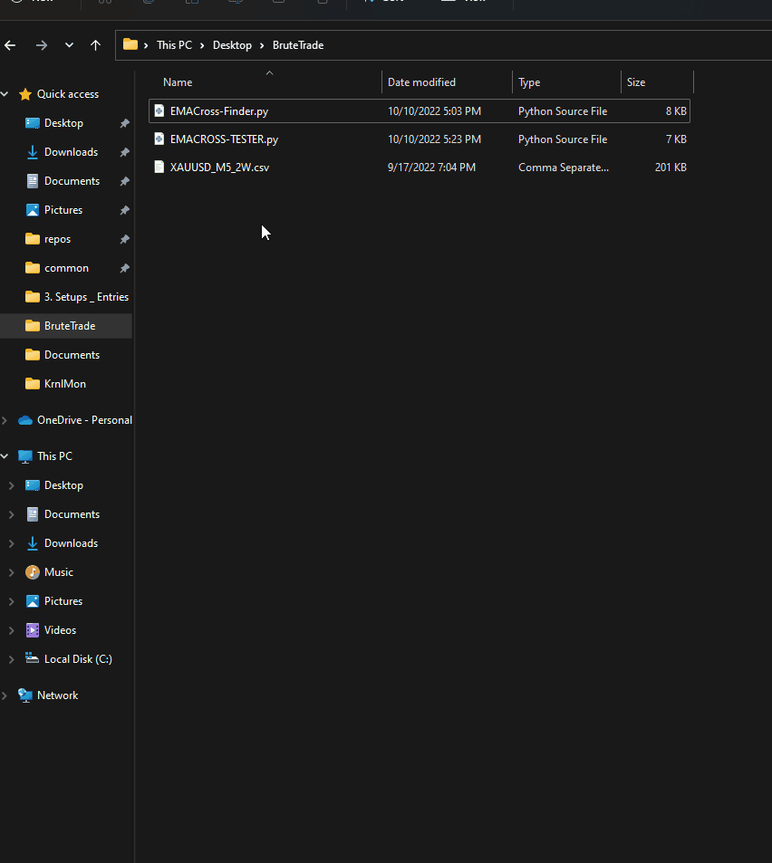

# BruteTrade

BruteTrade is a PoC to showcase how Brute-Forceing certain parameters can be utilized in a system to find potential Market Bias

Return of Using a MA-90 and MA-200 CrossOver on those 2 weeks on XAUUSD

#Obstacles

- Determine when to update parameters
- Find a Trading System that uses an edge (not just MA-Crossover)

Uses BackTesting.py and TALib

https://kernc.github.io/backtesting.py/

https://github.com/mrjbq7/ta-lib
